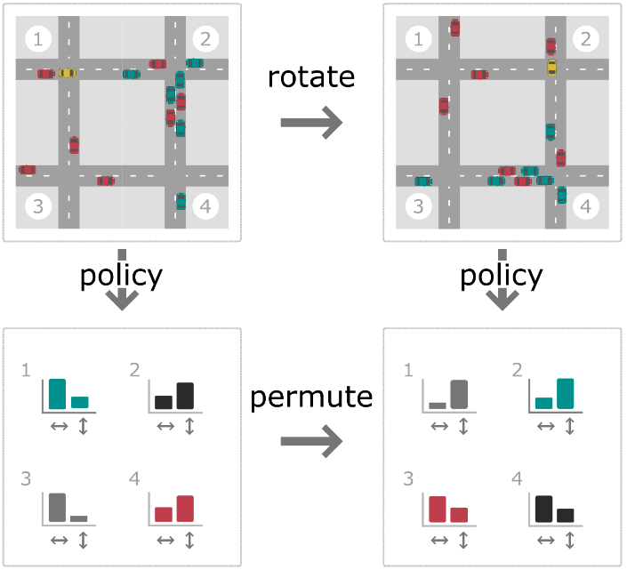

# Multi-Agent MDP Homomorphic Networks

Training code accompanying the paper:

**Multi-Agent MDP Homomorphic Networks**  
Elise van der Pol, Herke van Hoof, Frans A. Oliehoek, Max Welling.  

https://openreview.net/pdf?id=H7HDG--DJF0



**Abstract:** 
This paper introduces Multi-Agent MDP Homomorphic Networks, a class of networks that allows distributed execution using only local information, yet is able to share experience between global symmetries in the joint state-action space of cooperative multi-agent systems. In cooperative multi-agent systems, complex symmetries arise between different configurations of the agents and their local observations. For example, consider a group of agents navigating: rotating the state globally results in a permutation of the optimal joint policy. Existing work on symmetries in single agent reinforcement learning can only be generalized to the fully centralized setting, because such approaches rely on the global symmetry in the full state-action spaces, and these can result in correspondences across agents. To encode such symmetries while still allowing distributed execution we propose a factorization that decomposes global symmetries into local transformations. Our proposed factorization allows for distributing the computation that enforces global symmetries over local agents and local interactions. We introduce a multi-agent equivariant policy network based on this factorization. We show empirically on symmetric multi-agent problems that globally symmetric distributable policies improve data efficiency compared to non-equivariant baselines.

## RLPYT 
This repo is built into [RLPYT](https://github.com/astooke/rlpyt "RLPYT Github"), a codebase for Deep Reinforcement Learning algorithms in PyTorch. Specifically, we made changes to the code for [MDP-Homomorphic Networks](https://github.com/ElisevanderPol/mdp-homomorphic-networks "MDP Homomorphic Networks Github"). We have added code to use Multi-Agent MDP-homomorphic networks and made minor modifications. If you use this codebase please cite RLPYT as well.

## Installation
* Install the RLPYT framework, within the current repo, using the standard installation:
  * ```clone``` the current repo and ```cd``` into it
  * ``` conda env create -f linux_cuda10.yml ```
  * ``` source activate rlpyt ```
  * ``` pip install -e . ```
* Install the updated [MARL Symmetrizer](https://github.com/ElisevanderPol/marl_symmetrizer "MARL Symmetrizer Gitub") in the same rlpyt env:
  * ```clone``` the MARL Symmetrizer repo and ```cd``` into it
  * ``` pip install gym==0.17 ```
  * ``` pip install -e . ```
* Optionally: Install the [MARL environments](https://github.com/ElisevanderPol/marlenvs "MARL environments") in the same rlpyt env:
  * ```clone``` the marl environment repo and ```cd``` into it
  * ``` pip install -e . ```

## Usage
* ``` cd examples ```
* Wildlife:
  * ``` ./scripts/test_wildlife.sh ``` 
* Traffic:
  * ``` ./scripts/test_traffic.sh ```

### Cite
If you use this code in your own work, please cite our paper:
```
@inproceedings{van2022multi,
  title={Multi-Agent {MDP} Homomorphic Networks},
  author={van der Pol, Elise and van Hoof, Herke and Oliehoek, Frans A. and Welling, Max},
  booktitle={International Conference on Learning Representations},
  year={2022}
}
```

The Robert Bosch GmbH is acknowledged for financial support.
